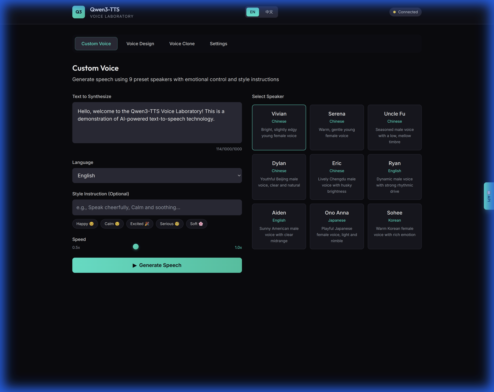
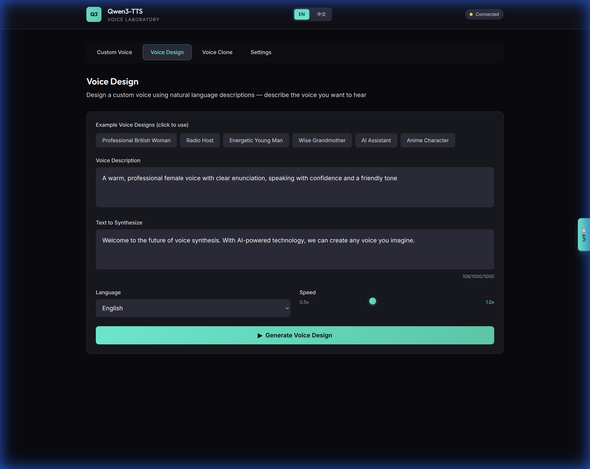
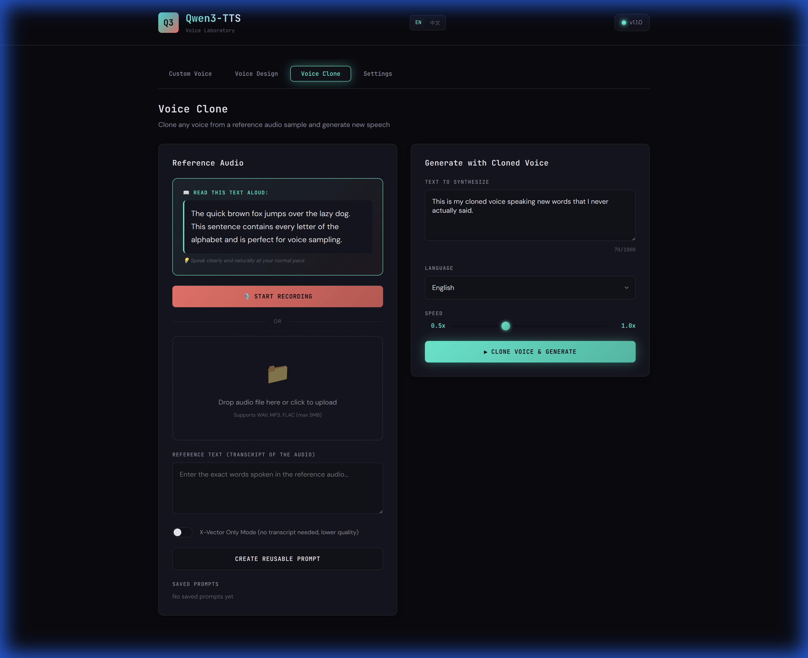
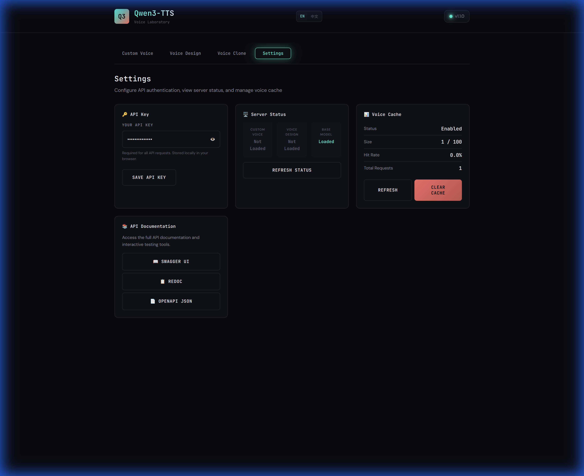

# Qwen3-TTS API Server

A production-ready FastAPI server for Qwen3-TTS models, supporting CustomVoice (preset speakers), VoiceDesign (natural language voice design), and Base models (voice cloning).

## Features

- **Multiple Model Support**: CustomVoice, VoiceDesign, and Base (voice cloning) models
- **Interactive Demo Page**: Built-in web UI for testing all API endpoints
- **Streaming & Batch Generation**: Real-time streaming or batch processing
- **Voice Prompt Caching**: Intelligent LRU cache for 60-80% latency reduction on repeated requests
- **Smart Audio Preprocessing**: Automatic silence removal, clipping, and normalization
- **Performance Monitoring**: Real-Time Factor (RTF) tracking and detailed metrics
- **Speed Control**: Adjust speech speed from 0.5x to 2.0x without pitch changes
- **API Key Authentication**: Secure access control
- **Docker Support**: Easy deployment with GPU support
- **Auto-generated Documentation**: Interactive API docs with Swagger UI
- **Lazy Model Loading**: Efficient memory usage by loading models on-demand
- **RESTful API**: Standard HTTP endpoints with JSON responses

## Quick Start

### Prerequisites

- Python 3.10 or higher
- NVIDIA GPU with CUDA support (recommended)
- At least 8GB GPU memory for 1.7B models (16GB recommended)
- Docker and docker-compose (for Docker deployment)

### Installation Options

**Option 1: Automated CUDA Installation (Linux with GPU) [RECOMMENDED]**

For Linux systems with NVIDIA GPU, use our automated installation script:

```bash
chmod +x install_cuda.sh
./install_cuda.sh
```

This script will:
- Create conda environment
- Install PyTorch with CUDA
- Install Flash Attention 2
- Download all models (~10-12 GB)
- Configure environment**

**Option 2: Manual Installation (All platforms)**

### Local Installation

1. **Activate conda environment**

```bash
conda activate qwen-tts  # or your preferred environment
```

2. **Install dependencies in order** (important!)

```bash
# Step 1: Install PyTorch first
pip install torch>=2.1.0 --index-url https://download.pytorch.org/whl/cu121

# Step 2: Install other dependencies
pip install -r requirements.txt

# Step 3 (Optional): Install Flash Attention for better performance
# This requires CUDA and takes 5-15 minutes to compile
pip install flash-attn>=2.5.0 --no-build-isolation
```

**Note:** Flash Attention is optional. If installation fails, the server works fine without it. Set `USE_FLASH_ATTENTION=false` in `.env`.

3. **Configure environment**

```bash
cp .env.example .env
# Edit .env with your configuration
```

4. **Start the server**

```bash
python -m uvicorn app.main:app --host 0.0.0.0 --port 8000
```

Or use the start script:

```bash
chmod +x start.sh
./start.sh
```

**See [INSTALL.md](INSTALL.md) for detailed installation instructions and troubleshooting.**

### Docker Installation

1. **Build and start with Docker Compose**

```bash
docker-compose up -d
```

2. **Check logs**

```bash
docker-compose logs -f
```

3. **Stop the server**

```bash
docker-compose down
```

## Configuration

Edit `.env` file to configure the server:

```bash
# Model Configuration
QWEN_TTS_CUSTOM_VOICE_MODEL=Qwen/Qwen3-TTS-12Hz-1.7B-CustomVoice
QWEN_TTS_VOICE_DESIGN_MODEL=Qwen/Qwen3-TTS-12Hz-1.7B-VoiceDesign
QWEN_TTS_BASE_MODEL=Qwen/Qwen3-TTS-12Hz-1.7B-Base
QWEN_TTS_TOKENIZER=Qwen/Qwen3-TTS-Tokenizer-12Hz

# Device Configuration
CUDA_DEVICE=cuda:0
MODEL_DTYPE=bfloat16
USE_FLASH_ATTENTION=true

# API Configuration
API_KEYS=your-api-key-1,your-api-key-2,your-api-key-3
HOST=0.0.0.0
PORT=8000

# Model Caching
HF_HOME=/app/models
MODEL_CACHE_DIR=/app/models

# Logging
LOG_LEVEL=INFO

# Model Loading
PRELOAD_MODELS=false

# Voice Prompt Caching (NEW in v1.1.0)
VOICE_CACHE_ENABLED=true
VOICE_CACHE_MAX_SIZE=100
VOICE_CACHE_TTL_SECONDS=3600

# Audio Preprocessing (NEW in v1.1.0)
AUDIO_PREPROCESSING_ENABLED=true
REF_AUDIO_MAX_DURATION=15.0
REF_AUDIO_TARGET_DURATION_MIN=5.0

# Audio Validation (NEW in v1.1.0)
AUDIO_UPLOAD_MAX_SIZE_MB=5.0
AUDIO_UPLOAD_MAX_DURATION=60.0

# Performance Monitoring (NEW in v1.1.0)
ENABLE_PERFORMANCE_LOGGING=true
ENABLE_WARMUP=true
WARMUP_TEXT="This is a warmup test to initialize the model."
```

## API Documentation

Once the server is running, access the interactive API documentation:

- **Demo Page**: http://localhost:8000/demo - Interactive web UI for testing all features
- **Swagger UI**: http://localhost:8000/docs
- **ReDoc**: http://localhost:8000/redoc
- **OpenAPI Schema**: http://localhost:8000/openapi.json

## Interactive Demo Page

The built-in demo page provides a rich visual interface for testing all TTS features:

### Custom Voice Tab
Generate speech using preset speakers with emotional control and style instructions.



### Voice Design Tab  
Create custom voices using natural language descriptions.



### Voice Clone Tab
Clone any voice from a reference audio sample with guided recording support.



### Settings Tab
Configure API access and monitor server status.



**Features:**
- 🌐 Bilingual UI (English / 中文)
- 🎙️ Built-in voice recording for cloning
- 💾 Save and reuse voice prompts
- 📊 Real-time server status monitoring
- 🎨 Retro-futuristic design

## API Endpoints

### Health Check

#### `GET /health`
Basic health check

```bash
curl http://localhost:8000/health
```

#### `GET /health/models`
Check which models are loaded

```bash
curl http://localhost:8000/health/models
```

### CustomVoice API

#### `POST /api/v1/custom-voice/generate`
Generate speech with preset speakers

```bash
curl -X POST http://localhost:8000/api/v1/custom-voice/generate \
  -H "X-API-Key: your-api-key-1" \
  -H "Content-Type: application/json" \
  -d '{
    "text": "Hello, this is a test of the Qwen TTS system.",
    "language": "English",
    "speaker": "Ryan",
    "instruct": "Speak in a cheerful and energetic tone",
    "response_format": "wav"
  }' \
  --output output.wav
```

#### `POST /api/v1/custom-voice/generate-stream`
Stream generation with Server-Sent Events

```bash
curl -X POST http://localhost:8000/api/v1/custom-voice/generate-stream \
  -H "X-API-Key: your-api-key-1" \
  -H "Content-Type: application/json" \
  -d '{
    "text": "This is streaming audio generation.",
    "language": "English",
    "speaker": "Aiden"
  }'
```

#### `GET /api/v1/custom-voice/speakers`
List available speakers

```bash
curl http://localhost:8000/api/v1/custom-voice/speakers \
  -H "X-API-Key: your-api-key-1"
```

#### `GET /api/v1/custom-voice/languages`
List supported languages

```bash
curl http://localhost:8000/api/v1/custom-voice/languages \
  -H "X-API-Key: your-api-key-1"
```

### VoiceDesign API

#### `POST /api/v1/voice-design/generate`
Generate speech with natural language voice description

```bash
curl -X POST http://localhost:8000/api/v1/voice-design/generate \
  -H "X-API-Key: your-api-key-1" \
  -H "Content-Type: application/json" \
  -d '{
    "text": "Welcome to the future of voice synthesis.",
    "language": "English",
    "instruct": "A warm, professional female voice with a slight British accent, speaking confidently and clearly",
    "response_format": "wav"
  }' \
  --output voice_design.wav
```

#### `POST /api/v1/voice-design/generate-stream`
Stream voice design generation

```bash
curl -X POST http://localhost:8000/api/v1/voice-design/generate-stream \
  -H "X-API-Key: your-api-key-1" \
  -H "Content-Type: application/json" \
  -d '{
    "text": "Streaming with custom voice design.",
    "language": "English",
    "instruct": "Deep male voice, calm and soothing"
  }'
```

### Base Model (Voice Cloning) API

#### `POST /api/v1/base/clone`
Clone voice from reference audio

```bash
curl -X POST http://localhost:8000/api/v1/base/clone \
  -H "X-API-Key: your-api-key-1" \
  -H "Content-Type: application/json" \
  -d '{
    "text": "This is cloned speech using the reference voice.",
    "language": "English",
    "ref_audio_url": "https://example.com/reference.wav",
    "ref_text": "This is the transcript of the reference audio.",
    "response_format": "wav"
  }' \
  --output cloned.wav
```

#### `POST /api/v1/base/create-prompt`
Create reusable voice clone prompt

```bash
curl -X POST http://localhost:8000/api/v1/base/create-prompt \
  -H "X-API-Key: your-api-key-1" \
  -H "Content-Type: application/json" \
  -d '{
    "ref_audio_url": "https://example.com/reference.wav",
    "ref_text": "This is the transcript of the reference audio.",
    "x_vector_only_mode": false
  }'
```

Response:
```json
{
  "prompt_id": "550e8400-e29b-41d4-a716-446655440000",
  "message": "Prompt created successfully"
}
```

#### `POST /api/v1/base/generate-with-prompt`
Generate using saved prompt

```bash
curl -X POST http://localhost:8000/api/v1/base/generate-with-prompt \
  -H "X-API-Key: your-api-key-1" \
  -H "Content-Type: application/json" \
  -d '{
    "text": "New text to synthesize with the saved voice.",
    "language": "English",
    "prompt_id": "550e8400-e29b-41d4-a716-446655440000",
    "response_format": "wav"
  }' \
  --output prompt_output.wav
```

#### `POST /api/v1/base/upload-ref-audio`
Upload reference audio file

```bash
curl -X POST http://localhost:8000/api/v1/base/upload-ref-audio \
  -H "X-API-Key: your-api-key-1" \
  -F "file=@reference.wav"
```

#### `GET /api/v1/base/cache/stats` (NEW in v1.1.0)
Get voice cache statistics

```bash
curl http://localhost:8000/api/v1/base/cache/stats \
  -H "X-API-Key: your-api-key-1"
```

Response:
```json
{
  "enabled": true,
  "size": 15,
  "max_size": 100,
  "hits": 120,
  "misses": 35,
  "evictions": 2,
  "hit_rate_percent": 77.42,
  "total_requests": 155
}
```

#### `POST /api/v1/base/cache/clear` (NEW in v1.1.0)
Clear all cached voice prompts

```bash
curl -X POST http://localhost:8000/api/v1/base/cache/clear \
  -H "X-API-Key: your-api-key-1"
```

## Performance Features (NEW in v1.1.0)

### Speed Control

All generation endpoints now support an optional `speed` parameter to adjust speech speed:

```bash
curl -X POST http://localhost:8000/api/v1/custom-voice/generate \
  -H "X-API-Key: your-api-key-1" \
  -H "Content-Type: application/json" \
  -d '{
    "text": "This will be spoken faster.",
    "language": "English",
    "speaker": "Ryan",
    "speed": 1.5
  }' \
  --output fast_speech.wav
```

Speed range: 0.5x (slower) to 2.0x (faster), default is 1.0x.

### Performance Metrics

All generation responses include performance headers:

```
X-Generation-Time: 2.340
X-Audio-Duration: 3.500
X-RTF: 0.670
X-Cache-Status: hit
X-Preprocessing-Time: 0.120
```

- **RTF (Real-Time Factor)**: Lower is better. 0.67x means it took 67% of the audio duration to generate.
- **Cache-Status**: Shows if voice prompt cache was used (`hit` or `miss`).

### Voice Caching

Voice prompts are automatically cached for faster repeated generations. Cache behavior is transparent:

1. First request with new reference audio: Cache miss, full feature extraction
2. Subsequent requests with same audio: Cache hit, 60-80% faster

Configure caching in `.env`:
```bash
VOICE_CACHE_ENABLED=true
VOICE_CACHE_MAX_SIZE=100
VOICE_CACHE_TTL_SECONDS=3600
```

### Audio Preprocessing

Reference audio is automatically preprocessed for optimal quality:

- Smart clipping to 5-15 seconds at natural pauses
- Silence removal from beginning and end
- Mono conversion and normalization

Configure preprocessing in `.env`:
```bash
AUDIO_PREPROCESSING_ENABLED=true
REF_AUDIO_MAX_DURATION=15.0
REF_AUDIO_TARGET_DURATION_MIN=5.0
```

## Python Client Examples

### CustomVoice Example

```python
import requests
import base64

API_KEY = "your-api-key-1"
BASE_URL = "http://localhost:8000"

headers = {
    "X-API-Key": API_KEY,
    "Content-Type": "application/json"
}

# Generate with CustomVoice
response = requests.post(
    f"{BASE_URL}/api/v1/custom-voice/generate",
    headers=headers,
    json={
        "text": "Hello from Python!",
        "language": "English",
        "speaker": "Ryan",
        "instruct": "Speak enthusiastically",
        "response_format": "base64"
    }
)

if response.status_code == 200:
    result = response.json()
    audio_data = base64.b64decode(result["audio"])
    
    with open("output.wav", "wb") as f:
        f.write(audio_data)
    
    print(f"Audio saved! Sample rate: {result['sample_rate']} Hz")
else:
    print(f"Error: {response.status_code} - {response.text}")
```

### VoiceDesign Example

```python
import requests

API_KEY = "your-api-key-1"
BASE_URL = "http://localhost:8000"

headers = {
    "X-API-Key": API_KEY,
    "Content-Type": "application/json"
}

# Generate with VoiceDesign
response = requests.post(
    f"{BASE_URL}/api/v1/voice-design/generate",
    headers=headers,
    json={
        "text": "Custom voice design in action.",
        "language": "English",
        "instruct": "A young male voice, 20-25 years old, speaking with excitement and energy",
        "response_format": "wav"
    }
)

if response.status_code == 200:
    with open("voice_design.wav", "wb") as f:
        f.write(response.content)
    print("Voice design audio saved!")
```

### Voice Cloning Example

```python
import requests
import base64

API_KEY = "your-api-key-1"
BASE_URL = "http://localhost:8000"

headers = {
    "X-API-Key": API_KEY,
    "Content-Type": "application/json"
}

# Read reference audio and encode to base64
with open("reference.wav", "rb") as f:
    ref_audio_base64 = base64.b64encode(f.read()).decode()

# Clone voice
response = requests.post(
    f"{BASE_URL}/api/v1/base/clone",
    headers=headers,
    json={
        "text": "This is my cloned voice speaking new words.",
        "language": "English",
        "ref_audio_base64": ref_audio_base64,
        "ref_text": "Original text from reference audio.",
        "x_vector_only_mode": False,
        "response_format": "wav"
    }
)

if response.status_code == 200:
    with open("cloned.wav", "wb") as f:
        f.write(response.content)
    print("Cloned voice saved!")
```

### Streaming Example

```python
import requests
import json
import base64

API_KEY = "your-api-key-1"
BASE_URL = "http://localhost:8000"

headers = {
    "X-API-Key": API_KEY,
    "Content-Type": "application/json"
}

# Stream audio generation
response = requests.post(
    f"{BASE_URL}/api/v1/custom-voice/generate-stream",
    headers=headers,
    json={
        "text": "Streaming audio in real-time.",
        "language": "English",
        "speaker": "Aiden"
    },
    stream=True
)

chunks = []
for line in response.iter_lines():
    if line:
        line_str = line.decode('utf-8')
        if line_str.startswith('data: '):
            data = line_str[6:]  # Remove 'data: ' prefix
            if data != "complete":
                try:
                    chunks.append(data)
                except:
                    pass

print(f"Received {len(chunks)} audio chunks")
```

## Available Speakers (CustomVoice)

| Speaker | Description | Native Language |
|---------|-------------|-----------------|
| Vivian | Bright, slightly edgy young female voice | Chinese |
| Serena | Warm, gentle young female voice | Chinese |
| Uncle_Fu | Seasoned male voice with a low, mellow timbre | Chinese |
| Dylan | Youthful Beijing male voice with a clear, natural timbre | Chinese (Beijing Dialect) |
| Eric | Lively Chengdu male voice with a slightly husky brightness | Chinese (Sichuan Dialect) |
| Ryan | Dynamic male voice with strong rhythmic drive | English |
| Aiden | Sunny American male voice with a clear midrange | English |
| Ono_Anna | Playful Japanese female voice with a light, nimble timbre | Japanese |
| Sohee | Warm Korean female voice with rich emotion | Korean |

## Supported Languages

- Auto (automatic language detection)
- Chinese
- English
- Japanese
- Korean
- German
- French
- Russian
- Portuguese
- Spanish
- Italian

## Performance Tips

1. **Enable Voice Caching**: Set `VOICE_CACHE_ENABLED=true` for 60-80% faster repeated requests
2. **Preload Models**: Set `PRELOAD_MODELS=true` for faster first request (requires more memory)
3. **Use Prompts**: For voice cloning, create reusable prompts to avoid re-extracting features
4. **Enable Warmup**: Set `ENABLE_WARMUP=true` to eliminate first-request latency
5. **Flash Attention**: Enable for faster inference on supported GPUs (`USE_FLASH_ATTENTION=true`)
6. **Model Size**: Use 0.6B models for faster inference with slightly lower quality
7. **Audio Preprocessing**: Keep `AUDIO_PREPROCESSING_ENABLED=true` for better voice clone quality
8. **Monitor Performance**: Check `X-RTF` headers to identify bottlenecks

### Performance Benchmarks (v1.1.0)

With caching enabled on RTX 4090:

| Operation | First Request | Cached Request | Speedup |
|-----------|--------------|----------------|---------|
| Voice Clone (Base) | 2.5s | 0.6s | 4.2x |
| CustomVoice | 1.8s | 1.8s | N/A |
| VoiceDesign | 2.1s | 2.1s | N/A |

Note: CustomVoice and VoiceDesign don't use voice caching (preset voices only).

## Troubleshooting

### GPU Memory Issues

If you encounter out-of-memory errors:

1. Use the 0.6B models instead of 1.7B:
   ```bash
   QWEN_TTS_CUSTOM_VOICE_MODEL=Qwen/Qwen3-TTS-12Hz-0.6B-CustomVoice
   QWEN_TTS_BASE_MODEL=Qwen/Qwen3-TTS-12Hz-0.6B-Base
   ```

2. Set `PRELOAD_MODELS=false` to load models on-demand

3. Reduce batch sizes in requests

### Flash Attention Issues

Flash Attention is **optional** and requires:
- NVIDIA GPU (Ampere or newer)
- CUDA Toolkit 11.8+
- PyTorch installed first

If Flash Attention fails to install:

1. Make sure torch is installed first:
   ```bash
   pip install torch>=2.1.0 --index-url https://download.pytorch.org/whl/cu121
   ```

2. Try installing with `--no-build-isolation`:
   ```bash
   pip install flash-attn>=2.5.0 --no-build-isolation
   ```

3. If it still fails, skip it and set `USE_FLASH_ATTENTION=false` in `.env`
   - The server works perfectly without Flash Attention
   - You'll just have slightly slower inference

### Model Download Issues

Models are automatically downloaded on first use. If you have download issues:

1. Pre-download models using ModelScope or HuggingFace CLI
2. Set `MODEL_CACHE_DIR` to point to your download location
3. Use local model paths instead of HuggingFace IDs

### API Key Issues

If authentication fails:

- Verify `API_KEYS` is set in `.env`
- Ensure you're passing `X-API-Key` header in requests
- For development without authentication, leave `API_KEYS` empty

## Performance Tips

1. **Preload Models**: Set `PRELOAD_MODELS=true` for faster first request (requires more memory)
2. **Use Prompts**: For voice cloning, create reusable prompts to avoid re-extracting features
3. **Batch Requests**: Use batch endpoints for multiple texts to improve throughput
4. **Flash Attention**: Enable for faster inference on supported GPUs
5. **Model Size**: Use 0.6B models for faster inference with slightly lower quality

## License

This project follows the Qwen3-TTS license. See the [official repository](https://github.com/QwenLM/Qwen3-TTS) for details.

## Citation

If you use this API server, please cite the Qwen3-TTS paper:

```bibtex
@article{Qwen3-TTS,
  title={Qwen3-TTS Technical Report},
  author={Hangrui Hu and Xinfa Zhu and Ting He and Dake Guo and Bin Zhang and Xiong Wang and Zhifang Guo and Ziyue Jiang and Hongkun Hao and Zishan Guo and Xinyu Zhang and Pei Zhang and Baosong Yang and Jin Xu and Jingren Zhou and Junyang Lin},
  journal={arXiv preprint arXiv:2601.15621},
  year={2026}
}
```

## Support

- **Official Qwen3-TTS**: https://github.com/QwenLM/Qwen3-TTS
- **Issues**: Report issues on the GitHub repository
- **Documentation**: Visit the interactive API docs at `/docs`

## Acknowledgments

This API server is built on top of the excellent [Qwen3-TTS](https://github.com/QwenLM/Qwen3-TTS) project by the Qwen team at Alibaba Cloud.
